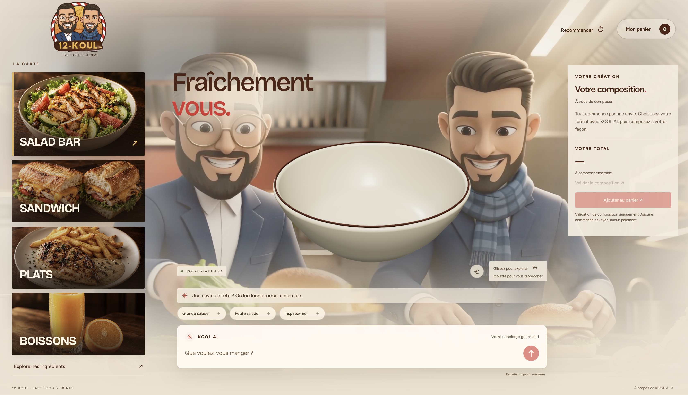
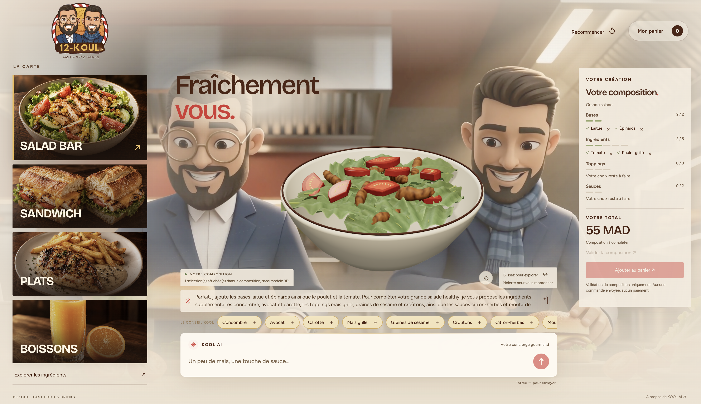
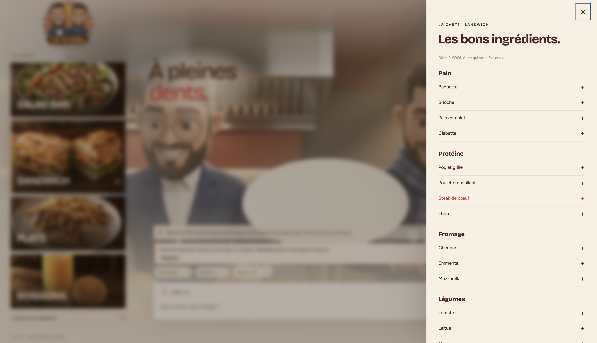
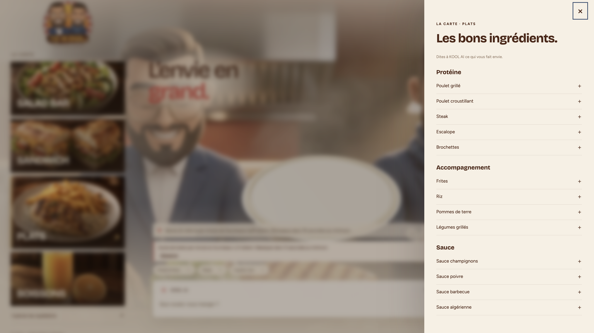
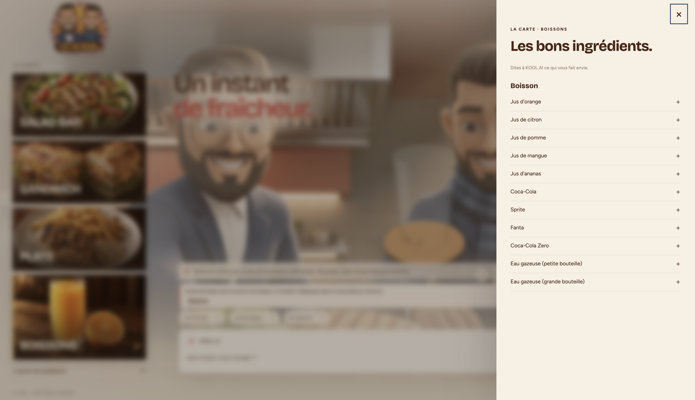
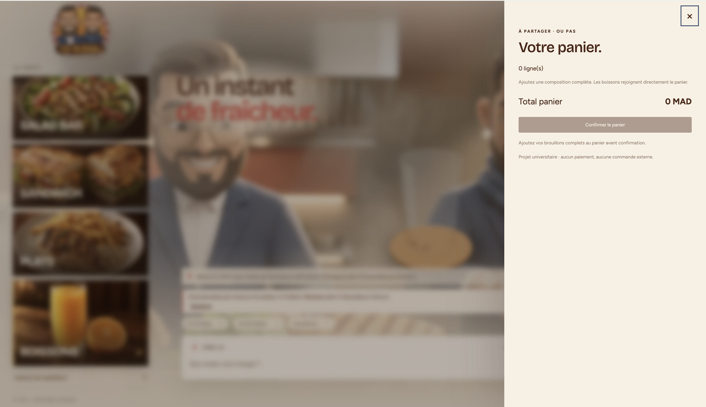
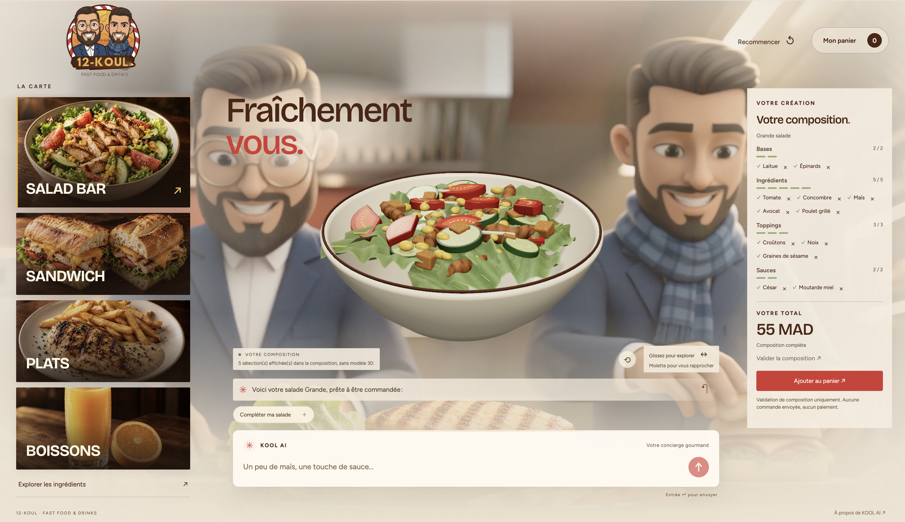
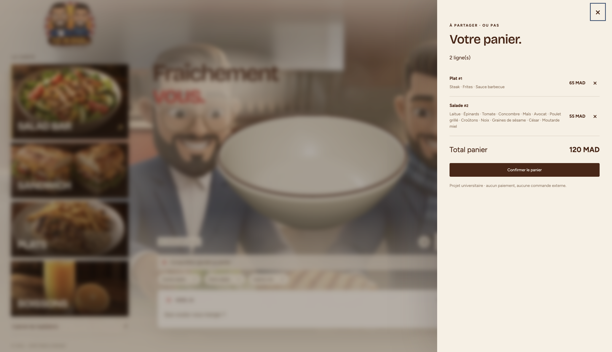
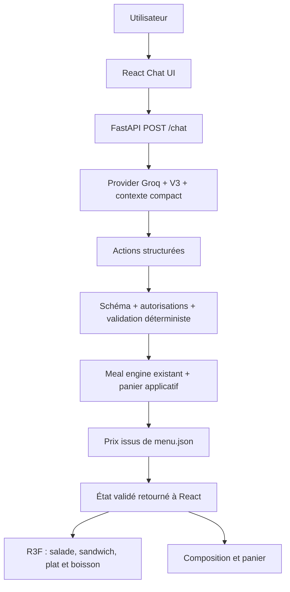

# 12-KOUL — Fast Food & Drinks

**Composez votre repas avec KOOL AI et regardez-le prendre forme en 3D.**

12-KOUL est une simulation universitaire de restaurant qui associe un assistant
conversationnel, une carte personnalisable et une scène Three.js interactive.
L’expérience desktop réunit quatre univers : **Salad Bar, Sandwich, Plats et Boissons**,
dans une ambiance de cuisine cinématique.

Le menu se trouve à gauche, le repas 3D au centre, la composition et son prix à droite,
et le chat KOOL AI en bas. Les ingrédients et les montants affichés proviennent de
l’état validé par le backend.

> Projet de démonstration : aucune commande n’est envoyée en cuisine et aucun paiement n’est effectué.

[Captures d’écran](#captures-décran) · [Installation](#installation-et-lancement) ·
[Utilisation](#utilisation) · [Architecture](#architecture) · [Tests](#tests-et-build)

## Fonctionnalités

- **Assistant KOOL AI** : composer un repas en langage naturel et recevoir des suggestions issues de la carte.
- **Visualisation 3D interactive** : rotation, zoom et animations d’ajout ou de retrait des ingrédients représentés.
- **Composition guidée** : suivi des bases, ingrédients, toppings et sauces, avec les quotas et prix validés côté serveur.
- **Carte par catégorie** : explorer les ingrédients des sandwichs et des plats, ainsi que les boissons disponibles.
- **Panier multi-plats** : regrouper les compositions complètes, ajouter des boissons et retirer une ligne précise.
- **Ambiance cinématique** : vidéo de fond en boucle, protections de lisibilité et prise en compte de `prefers-reduced-motion`.

## Captures d’écran

Ces huit captures montrent l’interface desktop et différentes étapes de composition.
Les fichiers originaux sont conservés dans [`docs/screenshots`](docs/screenshots/).

### 1. Accueil — une table prête à composer

La vue initiale présente les quatre catégories, le bol 3D vide et le champ de discussion
avec KOOL AI, devant la vidéo de cuisine.



### 2. Salade en cours — ingrédients et recommandations

Une grande salade prend forme avec la laitue, la tomate et le poulet grillé. Le panneau
de droite suit les choix effectués, tandis que KOOL AI propose des ingrédients pour
compléter la recette. Les sélections sans modèle 3D sont signalées sous la scène.



### 3. Carte sandwich — explorer les ingrédients

Le volet latéral permet de parcourir les pains, protéines, fromages et légumes
proposés pour composer un sandwich.



### 4. Carte plats — choisir sa combinaison

Les plats se composent à partir d’une protéine, d’un accompagnement et d’une sauce.
Le catalogue reste accessible sans quitter l’expérience principale.



### 5. Carte boissons — jus, sodas et eaux

Le volet boissons présente les références de la carte. Les boissons sélectionnées
rejoignent directement le panier sous forme de lignes indépendantes.



### 6. Panier vide — un état clairement indiqué

Le panier affiche son total et les conditions nécessaires à la confirmation.
Sans article, le bouton de confirmation reste désactivé.



### 7. Salade complète — prête à rejoindre le panier

La grande salade atteint ses quotas : deux bases, cinq ingrédients, trois toppings
et deux sauces. La composition complète est affichée à **55 MAD** et le bouton
« Ajouter au panier » devient disponible.



### 8. Panier multi-plats — récapitulatif avant confirmation

Le récapitulatif regroupe un plat à **65 MAD** et une salade à **55 MAD**, soit
**120 MAD** au total. Chaque ligne conserve ses ingrédients et son bouton de suppression.
La confirmation reste une simulation, sans commande externe.



## Technologies

| Couche | Technologies et rôle |
| --- | --- |
| Interface | React, TypeScript et Vite |
| Scène 3D | Three.js, React Three Fiber et Drei |
| API | Python, FastAPI et validation Pydantic |
| Assistant | Groq, modèle `openai/gpt-oss-120b` et prompt V3 |
| Règles métier | Moteur déterministe, catalogue `menu.json`, devis et panier |
| Vérification | Vitest, Testing Library, tests Node et unittest Python |

## Installation et lancement

Python 3.9+, Node compatible avec Vite 8 (Node 22.12+ recommandé), npm.
### 1. Préparer le backend

Depuis la racine :

```sh
python3 -m venv .venv
source .venv/bin/activate
python -m pip install -r backend/requirements.txt
cp -n .env.example .env
```

### 2. Configurer le modèle

Dans `.env`, renseigner **localement** `GROQ_API_KEY`, sans la publier ni l’envoyer au
frontend. `.env` et les résultats `*.local.json` sont ignorés par Git. Paramètres :

```dotenv
LLM_PROVIDER=groq
GROQ_API_KEY=
LLM_MODEL=openai/gpt-oss-120b
LLM_BASE_URL=https://api.groq.com/openai/v1
LLM_TIMEOUT_SECONDS=20
LLM_OVERALL_TIMEOUT_SECONDS=30
LLM_MAX_RETRIES=1
CORS_ORIGINS=http://localhost:5173,http://127.0.0.1:5173
```

L’URL doit être brute, sans syntaxe Markdown. Ne mettez jamais la clé dans une
variable `VITE_*`. Les variables déjà exportées ont priorité sur `.env`.

### 3. Lancer le backend

Utiliser **un seul worker** pour la mémoire locale :

```sh
LLM_PROVIDER=groq python -m uvicorn backend.app.main:app --env-file .env --host 127.0.0.1 --port 8000 --workers 1
```

### 4. Lancer le frontend

Dans un second terminal :

```sh
cd frontend
npm ci
npm run dev -- --host 127.0.0.1 --port 5173
```

Ouvrir `http://127.0.0.1:5173`. Le frontend utilise par défaut
`http://127.0.0.1:8000`; `VITE_API_BASE_URL` permet de changer cette adresse.
`/salad.html` conserve le vertical slice Salad autonome.

### Mode hors ligne

Pour travailler hors ligne : `LLM_PROVIDER=mock` au lancement backend. Ce provider
retourne seulement un accueil sans actions ; il ne simule pas une intelligence de
commande. Les providers scénarisés des tests sont explicitement des fixtures.

## Utilisation

- Utiliser le menu de gauche pour explorer les catégories, puis parler à KOOL AI.
- Exemple Sandwich : « Je veux un sandwich au poulet grillé avec baguette et sauce algérienne. »
- Exemple Plat : « Je veux un plat de poulet grillé avec des frites et une sauce barbecue. »
- Les choix incomplets restent des brouillons. « Ajouter au panier » est actif lorsque
  la catégorie est complète selon le backend ; le brouillon est alors transféré au panier.
- « Ajoute un Coca-Cola et un jus d’orange » crée deux lignes indépendantes.
  Plusieurs exemplaires d’une même boisson ont aussi des identifiants de ligne distincts.
- Retirer un ingrédient avec × autorise uniquement cet item et cette révision.
  Une simple phrase ne contourne pas cette autorisation. Pour une boisson dupliquée,
  utiliser la suppression de la ligne exacte du panier.
- La confirmation finale exige un panier non vide et aucun brouillon restant.
  Elle ne fait aucun appel à un service externe de commande.
- « Recommencer » efface l’historique, les brouillons et le panier concernés.

## Architecture



Le LLM ne manipule jamais Three.js, les prix, les quotas ou la confirmation réelle.
Les boutons panier sont des décisions explicites de l’interface, contrôlées par
révision côté backend. Ils ne nécessitent pas de détour par un LLM.

Le moteur générique couvre déjà les quatre catégories. `services/cart.py` compose
ses primitives validées : une boisson par brouillon, immédiatement transférée dans
une ligne indépendante. Le schéma des actions LLM ne change pas. Chaque lot est
atomique, y compris les modifications du panier. `quote` décrit les brouillons ;
`cart.total` décrit uniquement les lignes ajoutées au panier. React affiche ces
montants et ne les recalcule pas.

Le frontend active `cart_mode: true`. Le mode historique sans ce champ est conservé
pour les notebooks/tests et les anciens clients. Une conversation passée en mode
panier ne peut pas revenir silencieusement au mode historique.

## Modèle et évaluation

Le modèle réel est **Groq `openai/gpt-oss-120b`**, via le provider compatible existant.
Le prompt de production est V3, sélectionné après 42 réponses réelles : V1
8 PASS / 3 PARTIAL / 3 FAIL ; V2 11 / 2 / 1 ; V3 11 / 3 / 0. Une clarification
minimale du premier tour a ensuite été validée séparément. Les résultats historiques
ne constituent pas une réévaluation de cette révision.

## API

- `GET /health` : disponibilité du backend, sans appel au modèle.
- `GET /menu` : catalogue validé issu de `menu.json`.
- `POST /chat` : message, historique, actions, brouillons, devis et panier.
- `DELETE /chat/{conversation_id}` : reset ciblé.
- `/docs` : schéma OpenAPI interactif.

```sh
curl http://127.0.0.1:8000/chat -H 'Content-Type: application/json' -d '{"conversation_id":"demo","message":"Je veux un sandwich au poulet grillé avec baguette et sauce algérienne.","expected_revision":0,"cart_mode":true}'
```

Utiliser la `revision` réellement retournée pour l’appel suivant. Ajout au panier :

```json
{"conversation_id":"demo","message":"Ajouter au panier","expected_revision":1,"cart_mode":true,"cart_command":"add","cart_category":"sandwich"}
```

Suppression : `cart_command: "remove"` + `cart_line_id` renvoyé par le serveur.
Confirmation simulée : `cart_command: "confirm"`. Ces opérations exigent une révision.

```sh
curl -X DELETE http://127.0.0.1:8000/chat/demo
```

Erreurs : 422 entrée/action invalide, 409 révision périmée/conversation occupée,
502 réponse modèle inexploitable, 503 provider indisponible, 504 timeout. Les erreurs
ne publient ni clé, ni header d’authentification, ni stack trace.

## Tests et build

```sh
python -B -m unittest discover -s backend/tests -v
python -B -m unittest tools.test_semantic_review -v
cd frontend
npm test
npm run build
```

Les suites locales n’appellent pas Groq. La dernière vérification de finition desktop
compte **26 tests Vitest et 4 contrôles Node réussis**, avec un build de production réussi.
Le détail de cette passe est documenté dans la [revue desktop](docs/desktop-redesign/README.md).

Pour contrôler les deux formats desktop, ouvrir `/desktop-review.html` sur le serveur
Vite, puis choisir **1440 × 900** ou **1920 × 1080**.

Les tests automatisés restent distincts de l’évaluation du chatbot réel. Pour les comptages et la QA finale, voir
[le rapport final](docs/final-project-report.md). Aucun besoin de relancer les 42
scénarios pour une démonstration.

## Structure

- `backend/app/main.py`, `schemas/`, `api/` : API, validation Pydantic, conversations RAM.
- `backend/app/services/` : provider, contexte compact, actions, repas, prix et panier.
- `backend/app/data/menu.json` : unique source de vérité des produits/règles/prix.
- `backend/app/prompts/` : prompts historiques et V3 de production.
- `frontend/src/chat`, `state`, `api` : chat et synchronisation HTTP.
- `frontend/src/meal` : composition et panier.
- `frontend/src/salad` : scène salade, modèles GLB et projection de l’état validé.
- `frontend/src/3d` : conteneur, studio et scènes sandwich, plats et boissons.
- `frontend/src/experience` : vidéo d’ambiance, préférence de mouvement et retours visuels.
- `frontend/public` : logo officiel, photographies, modèles et vidéo de cuisine.
- `docs/screenshots` : les huit captures présentées dans ce README.
- `notebook/` : TP Phase 1 et résultats réels locaux.
- `tools/` : outils d’évaluation/prototypes ; aucun second chemin LLM en production.

## Limites connues

Conversations et paniers en RAM, perdus au redémarrage ; pas de base de données,
compte utilisateur, paiement ou cuisine externe. Maximum 40 lignes de panier.
L’historique applicatif reste borné à 40 messages / 16 000 caractères. Les prototypes
de mémoire déterministe restent dans `tools/` : ne pas les confondre avec une
summarization intégrée au chemin HTTP. Un long historique ou gros panier peut dépasser
le quota Groq du compte ; la limite observée précédemment était 8 000 TPM. Ne pas
multiplier les demandes rapprochées. Aucune garantie d’absence de 429/413 pour toute
conversation future.

Menu fictif ; disponibilité et nutrition inconnues, périmètre allergènes limité.
Le texte du modèle est non fiable ; les faits déterministes affichés font autorité.
La couverture 3D des ingrédients est partielle : les choix sans modèle restent visibles
dans la composition et sont signalés sous la scène. Les scènes utilisent des modèles GLB
et des représentations procédurales stylisées, non des reproductions photographiques. Les scènes sont chargées à la demande ;
un chunk 3D reste volumineux. FPS/mobile physique et charge multi-utilisateur non mesurés.

Archives : [revue sémantique](docs/semantic-evaluation.md),
[diagnostic du premier tour](docs/stage-3.10-first-turn-diagnostic.md).
