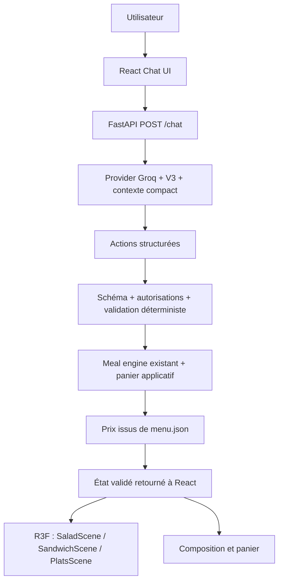

# 12-KOUL — FAST FOOD & DRINKS

12-KOUL est une simulation universitaire de restaurant avec **KOOL AI**, un chatbot
spécialisé : Salad Bar, Sandwich, Plats et Boissons. Composez dans le chat, observez
le repas, ajoutez les compositions complètes au panier et validez la simulation.
**Aucune commande n’est envoyée en cuisine ; aucun paiement n’est effectué.**

Le modèle réel est **Groq `openai/gpt-oss-120b`**, via le provider compatible existant.
Le prompt de production est V3, sélectionné après 42 réponses réelles : V1
8 PASS / 3 PARTIAL / 3 FAIL ; V2 11 / 2 / 1 ; V3 11 / 3 / 0. Une clarification
minimale du premier tour a ensuite été validée séparément. Les résultats historiques
ne constituent pas une réévaluation de cette révision.

## Installation et lancement

Python 3.9+, Node compatible avec Vite 8 (Node 22.12+ recommandé), npm.
Depuis la racine :

```sh
python3 -m venv .venv
source .venv/bin/activate
python -m pip install -r backend/requirements.txt
cp -n .env.example .env
```

Dans `.env`, renseigner **localement** `GROQ_API_KEY`, sans la publier ni l’envoyer au
frontend. `.env` et les résultats `*.local.json` sont ignorés par Git. Paramètres :

```dotenv
LLM_PROVIDER=groq
GROQ_API_KEY=
LLM_MODEL=openai/gpt-oss-120b
LLM_BASE_URL=https://api.groq.com/openai/v1
LLM_TIMEOUT_SECONDS=20
LLM_OVERALL_TIMEOUT_SECONDS=30
LLM_MAX_RETRIES=1
CORS_ORIGINS=http://localhost:5173,http://127.0.0.1:5173
```

L’URL doit être brute, sans syntaxe Markdown. Ne mettez jamais la clé dans une
variable `VITE_*`. Les variables déjà exportées ont priorité sur `.env`.

Backend, **un seul worker** pour la mémoire locale :

```sh
LLM_PROVIDER=groq python -m uvicorn backend.app.main:app --env-file .env --host 127.0.0.1 --port 8000 --workers 1
```

Frontend, dans un second terminal :

```sh
cd frontend
npm ci
npm run dev -- --host 127.0.0.1 --port 5173
```

Ouvrir `http://127.0.0.1:5173`. Le frontend utilise par défaut
`http://127.0.0.1:8000`; `VITE_API_BASE_URL` permet de changer cette adresse.
`/salad.html` conserve le vertical slice Salad autonome.

Pour travailler hors ligne : `LLM_PROVIDER=mock` au lancement backend. Ce provider
retourne seulement un accueil sans actions ; il ne simule pas une intelligence de
commande. Les providers scénarisés des tests sont explicitement des fixtures.

## Utilisation

- Utiliser les onglets pour explorer les catégories, puis parler à KOOL AI.
- Exemple Sandwich : « Je veux un sandwich au poulet grillé avec baguette et sauce algérienne. »
- Exemple Plat : « Je veux un plat de poulet grillé avec des frites et une sauce barbecue. »
- Les choix incomplets restent des brouillons. « Ajouter au panier » est actif lorsque
  la catégorie est complète selon le backend ; le brouillon est alors transféré au panier.
- « Ajoute un Coca-Cola et un jus d’orange » crée deux lignes indépendantes.
  Plusieurs exemplaires d’une même boisson ont aussi des identifiants de ligne distincts.
- Retirer un ingrédient avec × autorise uniquement cet item et cette révision.
  Une simple phrase ne contourne pas cette autorisation. Pour une boisson dupliquée,
  utiliser la suppression de la ligne exacte du panier.
- La confirmation finale exige un panier non vide et aucun brouillon restant.
  Elle ne fait aucun appel à un service externe de commande.
- « Nouvelle conversation » efface l’historique, les brouillons et le panier concernés.

## Architecture



Le LLM ne manipule jamais Three.js, les prix, les quotas ou la confirmation réelle.
Les boutons panier sont des décisions explicites de l’interface, contrôlées par
révision côté backend. Ils ne nécessitent pas de détour par un LLM.

Le moteur générique couvre déjà les quatre catégories. `services/cart.py` compose
ses primitives validées : une boisson par brouillon, immédiatement transférée dans
une ligne indépendante. Le schéma des actions LLM ne change pas. Chaque lot est
atomique, y compris les modifications du panier. `quote` décrit les brouillons ;
`cart.total` décrit uniquement les lignes ajoutées au panier. React affiche ces
montants et ne les recalcule pas.

Le frontend active `cart_mode: true`. Le mode historique sans ce champ est conservé
pour les notebooks/tests et les anciens clients. Une conversation passée en mode
panier ne peut pas revenir silencieusement au mode historique.

## API

- `GET /health` : disponibilité du backend, sans appel au modèle.
- `GET /menu` : catalogue validé issu de `menu.json`.
- `POST /chat` : message, historique, actions, brouillons, devis et panier.
- `DELETE /chat/{conversation_id}` : reset ciblé.
- `/docs` : schéma OpenAPI interactif.

```sh
curl http://127.0.0.1:8000/chat -H 'Content-Type: application/json' -d '{"conversation_id":"demo","message":"Je veux un sandwich au poulet grillé avec baguette et sauce algérienne.","expected_revision":0,"cart_mode":true}'
```

Utiliser la `revision` réellement retournée pour l’appel suivant. Ajout au panier :

```json
{"conversation_id":"demo","message":"Ajouter au panier","expected_revision":1,"cart_mode":true,"cart_command":"add","cart_category":"sandwich"}
```

Suppression : `cart_command: "remove"` + `cart_line_id` renvoyé par le serveur.
Confirmation simulée : `cart_command: "confirm"`. Ces opérations exigent une révision.

```sh
curl -X DELETE http://127.0.0.1:8000/chat/demo
```

Erreurs : 422 entrée/action invalide, 409 révision périmée/conversation occupée,
502 réponse modèle inexploitable, 503 provider indisponible, 504 timeout. Les erreurs
ne publient ni clé, ni header d’authentification, ni stack trace.

## Tests et build

```sh
python -B -m unittest discover -s backend/tests -v
python -B -m unittest tools.test_semantic_review -v
cd frontend
npm test
npm run build
```

Les suites locales n’appellent pas Groq. Pour les comptages et la QA finale, voir
[le rapport final](docs/final-project-report.md). Aucun besoin de relancer les 42
scénarios pour une démonstration.

## Structure

- `backend/app/main.py`, `schemas/`, `api/` : API, validation Pydantic, conversations RAM.
- `backend/app/services/` : provider, contexte compact, actions, repas, prix et panier.
- `backend/app/data/menu.json` : unique source de vérité des produits/règles/prix.
- `backend/app/prompts/` : prompts historiques et V3 de production.
- `frontend/src/chat`, `state`, `api` : chat et synchronisation HTTP.
- `frontend/src/meal` : composition et panier.
- `frontend/src/salad` : SaladScene existante, inchangée.
- `frontend/src/3d` : conteneur, studio et scènes Sandwich/Plats.
- `notebook/` : TP Phase 1 et résultats réels locaux.
- `tools/` : outils d’évaluation/prototypes ; aucun second chemin LLM en production.

## Limites connues

Conversations et paniers en RAM, perdus au redémarrage ; pas de base de données,
compte utilisateur, paiement ou cuisine externe. Maximum 40 lignes de panier.
L’historique applicatif reste borné à 40 messages / 16 000 caractères. Les prototypes
de mémoire déterministe restent dans `tools/` : ne pas les confondre avec une
summarization intégrée au chemin HTTP. Un long historique ou gros panier peut dépasser
le quota Groq du compte ; la limite observée précédemment était 8 000 TPM. Ne pas
multiplier les demandes rapprochées. Aucune garantie d’absence de 429/413 pour toute
conversation future.

Menu fictif ; disponibilité et nutrition inconnues, périmètre allergènes limité.
Le texte du modèle est non fiable ; les faits déterministes affichés font autorité.
Les nouvelles scènes utilisent une représentation stylisée procédurale des sélections,
non des reproductions photographiques. Les scènes sont chargées à la demande ;
un chunk 3D reste volumineux. FPS/mobile physique et charge multi-utilisateur non mesurés.

Archives : [revue sémantique](docs/semantic-evaluation.md),
[diagnostic du premier tour](docs/stage-3.10-first-turn-diagnostic.md).
